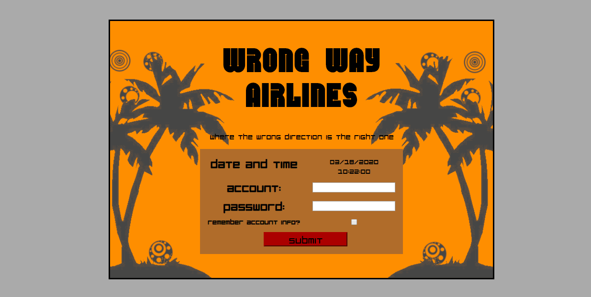

# Airline-Registrar
This is a simple Website I created, back before web development moved towards single page applications.
In this case, every page was updated using an embedded PHP loop to create and populate a grid full of data.
In retrospect the page is rather bulky and having individual files for each webpage made it difficult to modify.
Each page also utilizes a separate php files whose sole purpose are to access the sql database for basic CRUM operations.

This website makes use of simple CSS and floating Divs, below is small video showing the overall design and form inputs:

